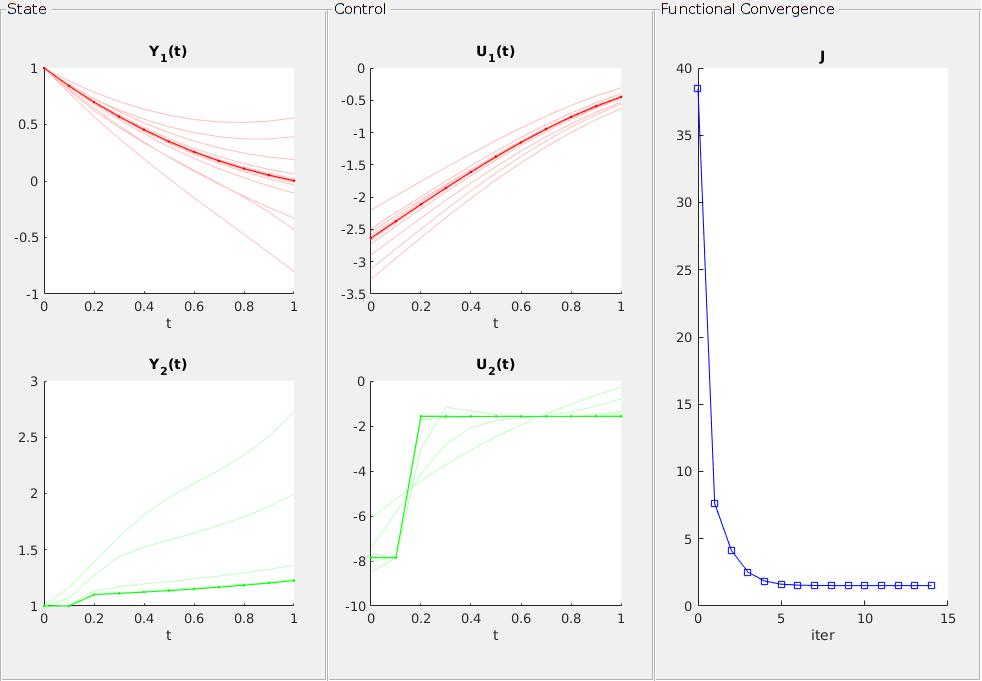

{::nomarkdown}

<header class="intro-header">

    

        

            
            

            
              DyCon Toolbox is a package for MATLAB dedicated to the resolution of control problems.
            
            

        

    

</header>

{:/nomarkdown}

      
  DyCon Toolbox solve the following problem :

  $$\min_{u \in \Omega} [ \Psi(t,Y(T)) + \int_0^T L(t,Y,U) dt ]
  \ \text{     with: }
    \dot{Y} = f(t,Y,U)$$

<table align="center" width="50%">
                    <tbody><tr>
                        <td>    

<pre class="highlight"><code>% define the state and control
Y = sym('y',[2 1]); U = sym('u',[2 1]);
% define your wierd dynamics
F = [ Y(1)*Y(2) + U(1)        ; ...
      Y(2)      + sin(U(2)) ] ;
dynamics = ode(F,Y,U);
dynamics.Condition = [1;1];
% define your functional with Y and U simbolic vars 
Psi = Y.'*Y; 
L   = 0.001* U.'*U;
% Create a OptimalControl Object 
iP = OptimalControl(dynamics,Psi,L);
% And Solve 
GradientMethod(iP,'Graphs',true)
</code></pre>

<pre class="highlight"><code>    Solve with presicion: 

    Solve with presicion: 

        We obtain: J(u) = 1.516010E+00

        mean(||dJ_i||^2) = 7.123165E-03

    With 15 iterations,     In 3.4525 seconds

</code></pre>

  </td>
  <td></td>

</tr>
</tbody></table>

<h1>Main Features</h1>
<ul>
  <li>
    <h3>Symbolic Interface</h3> 
    This toolbox uses the
  </li>
  <li>
    <h3>Non-linear dynamics</h3>
      Non-linear dynamics is the first implementation in the toolbox. Our idea is to cover very general problems in a few lines of code.
      <!-- 
<a href="{{site.url}}{{site.baseurl}}/tutorial/tp02/T0008">see more...</a>
  -->

  </li>
  <li>
    <h3>Scalable</h3>
      This Toolbox is a container of different optimization algorithms, where new methods can be developed within a structure already built and with reusable functions, for the comparison of results.
  </li>

</ul>

  

    <small>The DyCon MATLAB toolkit is developed primarily by the Chair of Computational Mathematics, at DeustoTech. However, we welcome any improvement in the computational platform. Contact the DyCon Toolbox developer team dycon-dev-group@deusto.es for more information.</small>  
  

